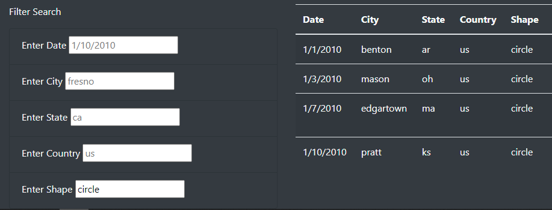
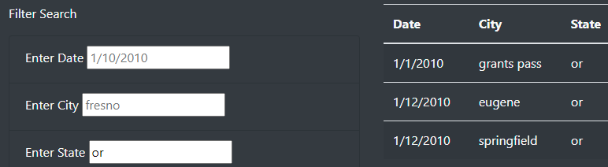

# UFOs

## Overview of Project
> Write javascript app to filter data by multiple inputs.   

### Results
> UFO Finder App

> The data on the UFO webpage is easily filtered by date, city, state, country, shape, or any combination thereof. Provided there is information available that matches the search criteria, results will be displayed with all of the aforementioned data as well as the duration of the UFO sighting and any comments. 

    - UFO sightings filtered by shape. 

    - UFO sightings filtered by state. 

## Summary
> One noticable drawback to this layout is the inablility to sort the results to put them in order by date or group them by state for example. I would recommend adding this feature as well as adding a message to display when there are no results that meet the search criteria rather than leaving a blank table which can lead to confusion about whether the search feature is working. 